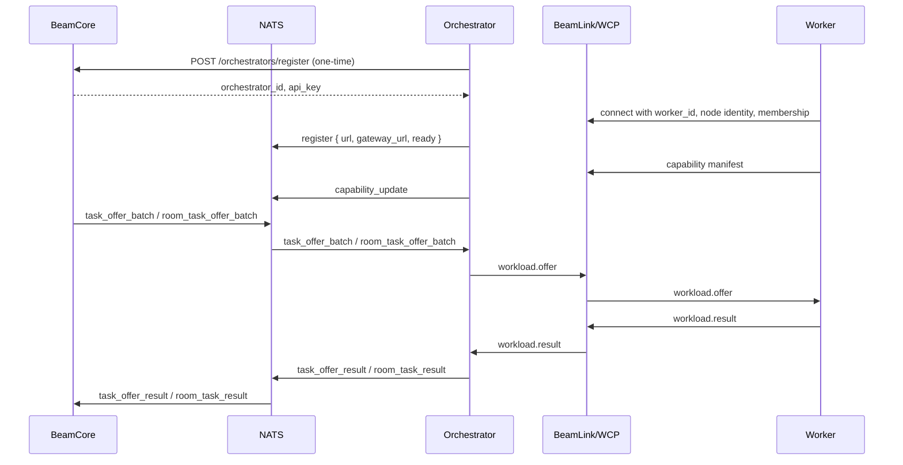

# Orchestrators

Orchestrators operate worker pools, connect to BeamCore over NATS, route executable task and Room transfer offers to workers, and report worker outcomes back to BeamCore. PRISM uses verified assignment duels and separate workload profiles to determine routing share.

## Role

An orchestrator is responsible for:

1. Maintaining a BeamLink/WCP worker session pool.
2. Receiving `task_offer_batch` and `room_task_offer_batch` messages from BeamCore over NATS.
3. Selecting a connected local worker for each offer.
4. Relaying `task_offer_result` and `room_task_result` messages to BeamCore immediately.
5. Publishing aggregate capability updates from connected workers.
6. Staying connected and ready so BeamCore can route work.

## Pools

| Pool       | Routing                     |
| ---------- | --------------------------- |
| Qualifying | Calibration transfers       |
| Qualified  | Production client transfers |

Each workload has its own pool and confidence score. Standard transfers use a 120-task confidence target; room transfers use 40. Both graduate at confidence >= 0.9 with the existing success-rate and 24-hour maturity calculation. You can receive production standard transfers while receiving only qualifying room transfers, or the reverse. Recovery does not advance qualification.

## Worker Sessions

Workers connect to the orchestrator over BeamLink/WCP. The orchestrator listens on `BEAM_WCP_LISTEN_ADDR` with `BEAM_WCP_TLS_CERT` and `BEAM_WCP_TLS_KEY`; workers connect to `BEAM_WCP_ADDRESS` and validate `BEAM_WCP_CA` and `BEAM_WCP_SERVER_NAME`. The orchestrator advertises `BEAMCORE_GATEWAY_URL` to BeamCore. The WCP session forwards each workload offer to a selected worker and relays worker results back through the orchestrator.



## Batch Offer Message

BeamCore sends executable normal-transfer offers directly:

```json
{
	"type": "task_offer_batch",
	"batch_id": "uuid",
	"assignment_timeout_ms": 60000,
	"offers": [
		{
			"offer_id": "uuid",
			"source": {
				"url": "https://source-presigned-url",
				"headers": { "Range": "bytes=0-41943039" },
				"chunk_size": 41943040
			},
			"destinations": [
				{ "url": "https://dest-presigned-url", "etag_required": true }
			]
		}
	]
}
```

Each offer delivers one source range to every listed destination; offers with several destinations go only to orchestrators that advertise `transfer.multipart.fanout.v1`. The orchestrator keeps worker assignment local and forwards every offer to a connected worker as `workload.offer`. Local validation or execution failures are reported as failed destinations in `task_offer_result`.

Room transfer offers arrive as `room_task_offer_batch` with schema `room-transfer/v1`. The orchestrator turns each eligible lane into a `room.transfer` workload.

## Capability Advertisement

Workers send canonical capability manifests to the orchestrator over WCP. The orchestrator aggregates fresh worker manifests and publishes `capability_update` to BeamCore. Manifest fields are `actor_type`, `actor_id`, `software_version`, `protocols`, `capabilities`, `capacity`, `observed_at`, and `expires_at`.

`transfer.multipart` protocol version 2 is the baseline normal-transfer capability; older versions receive no offers. `room.transfer` enables Room data-transfer lanes. Fresh manifests are authoritative.

## Task Results

Workers report task outcomes with canonical `task_offer_result`, one per offer:

```json
{
	"type": "task_offer_result",
	"offer_id": "uuid",
	"worker_id": "worker-uuid",
	"destinations": [{ "etag": "\"abc123\"" }]
}
```

`destinations` holds one outcome per offer destination, in order: `etag` on success, `error` on failure.

BeamCore derives verified bytes from trusted task metadata and computes bandwidth from offer send time to completion time.

## Registration

Registration is a one-time step that creates your orchestrator record in BeamCore and issues your API key. It must happen **before** the orchestrator connects to NATS — the NATS `register` message only declares your live gateway and readiness, it cannot create the record. An orchestrator that connects without registering first is rejected with `orchestrator_not_routable`.

**Prerequisite:** the hotkey must already be registered on the subnet's metagraph netuid. Otherwise registration fails with `403 hotkey is not registered on this subnet`.

**First-time registration** is unauthenticated and requires a hotkey signature over the message `{hotkey}:{fee_percentage}`:

```
POST $CORE_SERVER_URL/orchestrators/register
Content-Type: application/json

{
  "hotkey": "5F...",
  "signature": "0x...",
  "fee_percentage": 10,
  "name": "my-orchestrator",
  "region": "us-east",
  "url": "https://my-orchestrator.example.com",
  "max_workers": 1000
}
```

Only `hotkey` is required. `fee_percentage` accepts `0`-`100` and defaults to `10`. `name`, `description`, `contact`, `url`, `region`, `max_workers`, `uid`, and `slot_number` are optional; the UID is resolved from the metagraph, so a submitted `uid` is reconciled rather than trusted.

**Example response:**

```json
{
  "orchestrator_id": "...",
  "hotkey": "5F...",
  "api_key": "...",
  "message": "orchestrator registered"
}
```

The `api_key` field is returned **only on first registration** and is not retrievable afterwards — save it immediately.

**Updating metadata** later uses the same endpoint with `x-api-key` instead of a signature:

```
POST $CORE_SERVER_URL/orchestrators/register
x-api-key: <orchestrator-api-key>
Content-Type: application/json

{ "hotkey": "5F...", "region": "eu-west", "max_workers": 2000 }
```

In production, `$CORE_SERVER_URL` is `https://beamcore.b1m.ai`.

### Troubleshooting

`orchestrator_not_routable` when the orchestrator sends its NATS `register` message means BeamCore has no orchestrator record for that hotkey — either registration was never completed, or the hotkey is registered on a different chain or netuid than the environment you are connecting to.

## Setup

Complete [Registration](#registration) first, then set `CORE_SERVER_URL`, `BEAM_ENV=prod`, `BEAMCORE_NATS_URL`, `BEAMCORE_NATS_USER`, `BEAMCORE_NATS_PASSWORD`, `BEAMCORE_GATEWAY_URL`, `BEAM_WCP_LISTEN_ADDR`, `BEAM_WCP_TLS_CERT`, `BEAM_WCP_TLS_KEY`, and wallet settings. Set production `BEAMCORE_NATS_URL` to `tls://orch-gateway.b1m.ai:4222`. Workers connect with `BEAM_WCP_ADDRESS`, `BEAM_WCP_CA`, `BEAM_WCP_SERVER_NAME`, and their orchestrator membership. Keep the NATS control connection and WCP worker sessions healthy so BeamCore can deliver batches.

## Scores and history

Read workload profiles, transfer results and assignment history through the [supported telemetry APIs](./api-reference). See [PRISM scoring](./prism) for how reliability, speed and performance points work together.

## History Reset

Orchestrators can reset their task history and workload profiles in a single call. Each active profile returns to the qualifying pool; its confidence and performance points start again.

| Current pool | After reset |
|---|---|
| Qualified | Demoted to qualifying pool; must re-accumulate confidence and evidence to graduate again |
| Qualifying | Stays in qualifying; confidence and point total reset |

**What is deleted:**
- Your operational task and batch history
- Fraud penalties attributed to this orchestrator
- Your active workload profiles and qualification progress are reset; opponents' valid points and published audit snapshots remain intact

**What is preserved:**
- Published scoring and audit history — earlier snapshots retain their original evidence
- Identity fields (hotkey, UID, name, region)
- Worker registrations
- On-chain weight submissions

**Endpoint:**

```
DELETE /orchestrators/history
x-api-key: YOUR_ORCHESTRATOR_KEY
Content-Type: application/json

{ "confirm": true }
```

The `confirm: true` body field is required to prevent accidental deletion. The call returns `409` while you have active standard or room assignments. Wait for that work to finish before resetting.

**Example response:**

```json
{
  "success": true,
  "orchestrator_id": "...",
  "previous_pools": { "standard_transfers": "qualified", "room_transfers": "qualifying" },
  "new_pools": { "standard_transfers": "qualifying", "room_transfers": "qualifying" },
  "demoted_workloads": ["standard_transfers"],
  "history_deleted_at": "2026-06-19T12:00:00.000Z",
  "deleted": {
    "tasks": 187
  }
}
```

This operation is **irreversible**. The `history_deleted_at` field on the orchestrator row is updated each time this endpoint is called.
